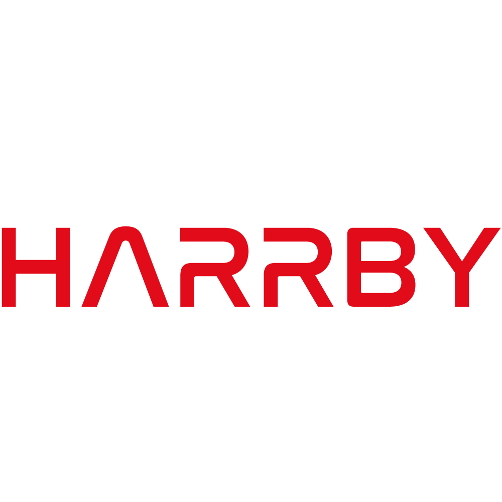

# Harrby - Managed Services Provider

Welcome to the official GitHub repository for Harrby Pty Ltd, a premier Managed Services Provider (MSP) specializing in Microsoft Cloud Solutions. As Australia's leading MSP, we provide comprehensive IT management services to optimize Azure, Microsoft 365, and Dynamics 365 environments for businesses across various industries.

## About Harrby

Harrby is dedicated to helping businesses thrive through fully managed IT services, including:

- **Microsoft Azure Solutions Management**: Expert management of Azure infrastructure for business scalability, security, and operational efficiency.

- **Microsoft 365 Administration**: Deployment, migration, and ongoing management of Microsoft 365 environments to enhance productivity and collaboration.

- **Dynamics 365 Solutions**: Tailored management of Dynamics 365 for optimizing business processes, customer engagement, and data-driven decision-making.

- **Cloud Security & Compliance**: Comprehensive security management to ensure data protection and regulatory compliance for cloud environments.

- **IT Infrastructure Management**: End-to-end IT support and consulting to streamline operations and improve technology performance.

At Harrby, we are committed to delivering reliable and innovative managed services that enable businesses to stay competitive in the digital landscape.

## Getting Started

To explore how Harrby can manage your IT infrastructure, follow these steps:

1. **Contact Us**: Visit our [website](https://www.harrby.com) to discuss your business needs.
2. **Consultation**: Schedule a consultation with our experts to design a customized managed services solution.
3. **Implementation**: Our team will handle the deployment, management, and ongoing support of your IT environment.

## Contributing

We welcome community involvement! Review our [contributing guidelines](CONTRIBUTING.md) for details on how you can collaborate on our projects.

## Support

For assistance with any of our services, reach out to us:

- **Email**: hello@harrby.com
- **Phone**: 1300 610 010
- **Documentation**: Check out our [documentation page](#) for detailed guides and support.

## License

Our repositories typically follow open-source licenses such as MIT or Apache 2.0, depending on the project.

## Connect with Us

- **Website**: [harrby.com](https://www.harrby.com)
- **X**: [Harrby X](https://twitter.com/HarrbyPtyLtd)
- **Facebook**: [Harrby Facebook](https://www.facebook.com/HarrbyPtyLtd)
- **Instagram**: [Harrby Instagram](https://www.instagram.com/HarrbyPtyLtd)
- **YouTube**: [Harrby YouTube](https://www.youtube.com/@HarrbyPtyLtd)
- **LinkedIn**: [Harrby LinkedIn](https://linkedin/company/Harrby)

Thank you for trusting Harrby as your Managed Services Provider for Microsoft Cloud Solutions! We look forward to supporting your business growth.

